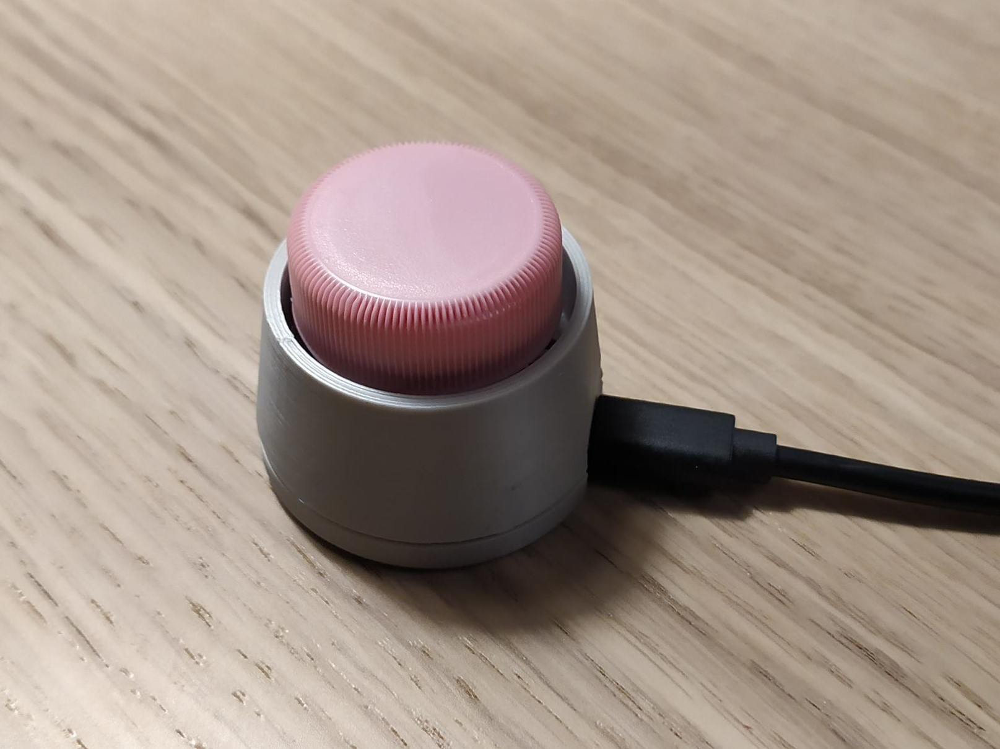

# Microphone Mute/Unmute Button for Microsoft Teams

This is an Arduino Micro based HID device that can mute or unmute the microphone in a Microsoft Teams meeting.



## How It Works

Microsoft Teams provides [keyboard shortcuts](https://support.microsoft.com/en-us/office/keyboard-shortcuts-for-microsoft-teams-2e8e2a70-e8d8-4a19-949b-4c36dd5292d2) to help users work more efficiently, and there is a dedicated shortcut (CTRL+SHIFT+M on Windows and CMD+SHIFT+M on MacOS) to mute or unmute the microphone during a meeting.

The Arduino Pro Micro microcontroller has an ATmega32U4 chip that is equipped with a full-speed USB transceiver, and it can be programmed to act like a HID-class (Human Interface Device) USB device.

In this project we program the Arduino Pro Micro to act like a USB keyboard that sends the Ctrl+Shift+M keystrokes when the button is pressed.


## How To Make It

### Parts

You will need the following parts to build this project:

- 3D printed case (3 parts)
- Arduino Pro Micro controller board
- Cherry MX mechanical switch
- pin headers (2× 1 pin is enough or you can use rows)
- female-female Dupont cable to connect the switch to the Arduino
- pet bottle cap
- 2× M3 screws and nuts
- USB cable to connect the Arduino to your computer

### 3D Printing

In the `models` folder you can find the STL files ready to 3D print. You can print them without support with 0.2 mm layer height.

Compared to [JH Jeong's Bottle Cap Keyboard project](https://www.thingiverse.com/thing:3551855) the STL files in this repository contain the following changes:

- The `bottom_case` is modified to accomodate Allen screws that have thicker heads. 
- The screw holes in the `bottom_case` have a sacrificial layer you have to remove after printing. This way no support is needed.
- The `key_cap` is modified to tight fit Cherry MX keys. In case your mechanical switch is different feel free to customize the Fusion360 and STEP files I attached.

### Wiring

Wiring is very simple: just connect the switch between the GND and Pin8 of the Arduino. You can follow [fmtuve's excellent build video](https://www.youtube.com/watch?v=AGkbZXVQaqw).

### Programming

Open the `Microsoft_Teams_Mic_Mute_Button.ino` file from this repository in the Arduino IDE.

If you are using Microsoft Teams on Windows, you can upload the code to the Arduino as is.

If you are using Microsoft Teams on MacOS, you have to modify the code before upload to use the CMD key instead of CTRL. Change this line:
```
Keyboard.press(KEY_LEFT_CTRL);
```

to this:
```
Keyboard.press(KEY_LEFT_GUI);
```


## Acknowledgements

Many thanks to JH Jeong for publishing his [Bottle Cap Keyboard](https://www.thingiverse.com/thing:3551855) work on Thingiverse that served as the basis of this project.

## About the author

This project was created by [György Balássy](https://linkedin.com/in/balassy).
